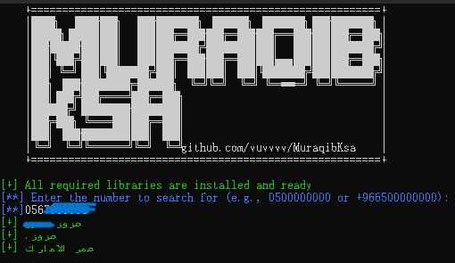

# MuraqibKsa

# مراقب KSA

# Description

&nbsp;&nbsp;&nbsp;
&nbsp;&nbsp;&nbsp;
&nbsp;&nbsp;&nbsp;
This is an open-source, command-line interface (CLI) tool designed to help users identify callers in Saudi Arabia by their mobile phone number.

&nbsp;&nbsp;&nbsp;
&nbsp;&nbsp;&nbsp;
&nbsp;&nbsp;&nbsp;

# Installation And Run

## For windows

&nbsp;&nbsp;&nbsp;
&nbsp;&nbsp;&nbsp;

- Download
  `git clone https://github.com/vuvvvv/MuraqibKsa.git`
- Install requirements.txt
  `pip install -r requirements.txt`
- Run
  `python .\MuraqibKsa.py  `
  Or
  `python .\MuraqibKsa.py Number phone `

### There are issues in Windows with Arabic language support. Follow these steps to make it work

&nbsp;&nbsp;&nbsp;

- before run `python .\MuraqibKsa.py` in your cmd to supports UTF-8 encoding to correctly display Arabic text use `chcp 65001`
  &nbsp;&nbsp;&nbsp;
- And change font from cmd to
  `Simsun-ExtB`
  &nbsp;&nbsp;&nbsp;
  &nbsp;&nbsp;&nbsp;
  
  &nbsp;&nbsp;&nbsp;
  &nbsp;&nbsp;&nbsp;
  
  &nbsp;&nbsp;&nbsp;
  &nbsp;&nbsp;&nbsp;

## For Linux

&nbsp;&nbsp;&nbsp;
&nbsp;&nbsp;&nbsp;

- Download
  `git clone https://github.com/vuvvvv/MuraqibKsa.git`

- install requirements.txt
  `pip install -r requirements.txt`
- Run
  `python .\MuraqibKsa.py  `
  or
  `python .\MuraqibKsa.py Number phone `

## For Mac Os

&nbsp;&nbsp;&nbsp;
&nbsp;&nbsp;&nbsp;

 Not yet 

## For Termux

&nbsp;&nbsp;&nbsp;
&nbsp;&nbsp;&nbsp;

 Not supported 

| Operating System | Support Status |
| ---------------- | -------------- |
| Windows          | Supported      |
| Linux            | Supported      |
| macOS            | Not Yet Tested |
| Termux           | Not Supported  |

&nbsp;&nbsp;&nbsp;
&nbsp;&nbsp;&nbsp;
&nbsp;&nbsp;&nbsp;

# Compile

&nbsp;&nbsp;&nbsp;
&nbsp;&nbsp;&nbsp;

- windows
  install Python `https://www.python.org/downloads/release/python-3110/` recommend Python 3.11.0

&nbsp;&nbsp;&nbsp;
&nbsp;&nbsp;&nbsp;

- Linux

* **Debian**
  install Python `sudo apt install python3`
  &nbsp;&nbsp;&nbsp;
* **Arch**
  install Python `sudo pacman -S python`
  &nbsp;&nbsp;&nbsp;
* **OpenSUSE**
  install Python `sudo zypper install python3`

&nbsp;&nbsp;&nbsp;
&nbsp;&nbsp;&nbsp;

### **Library**

- The `check_requirements.py` file uses the `check_library_installed` function to verify the installation status of packages

- Or install the required Python packages from the `requirements.txt` file, use `pip install -r requirements.txt`

&nbsp;&nbsp;&nbsp;
&nbsp;&nbsp;&nbsp;
&nbsp;&nbsp;&nbsp;
&nbsp;&nbsp;&nbsp;
| Library | Description | Version | Support Status |
|---------------------|---------------------------------------------------------------------------------------------------------|----------|----------------|
| selenium | For browser automation, helping with UI testing, web automation, and data scraping. | 4.33.0 | Supported |
| arabic_reshaper | For processing and reshaping Arabic text to ensure correct display in environments that may not natively support Arabic script. | 3.0.0 | Supported |
| python-bidi | For handling bidirectional text (like Arabic and Hebrew), ensuring its proper rendering and orientation. | 0.6.6 | Supported |
