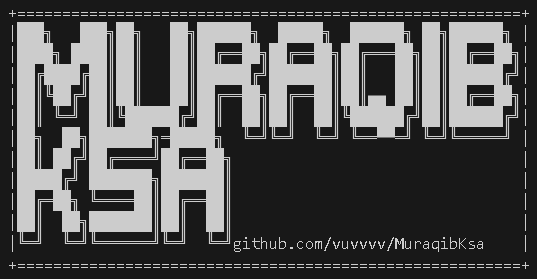

# MuraqibKSA KSAمراقب

  

  
  

# Description

This is an open-source, command-line interface (CLI) tool designed to help users identify callers in Saudi Arabia by their mobile phone number.
  

# Installation

## **For windows**

- Download`git clone https://github.com/vuvvvv/MuraqibKsa.git`
    

- Install requirements.txt
  `pip install -r requirements.txt`
    

- Run
  `python .\MuraqibKsa.py  `
  Or
  `python .\MuraqibKsa.py Number phone `

### There are issues in Windows with Arabic language support. Follow these steps to make it work

  

- Before run `python .\MuraqibKsa.py` in your cmd to supports UTF-8 encoding to correctly display Arabic text use `chcp 65001`
    
- And change font from cmd to
  `Simsun-ExtB`

  _Font_
    

  

  
  

  

## **For Linux**

- Download
  `git clone https://github.com/vuvvvv/MuraqibKsa.git`
    

- install requirements.txt
  `pip install -r requirements.txt`
    

- Run
  `python .\MuraqibKsa.py  `
  or
  `python .\MuraqibKsa.py Number phone `
    
    
    

  

## **For Mac Os**

**_Not yet_**

## **For Termux**

**_Not supported_**

  
  

| Operating System | Support Status |
| ---------------- | -------------- |
| Windows          | Supported      |
| Linux            | Supported      |
| macOS            | Not Yet Tested |
| Termux           | Not Supported  |

  
  
  

# Compile

  

Windows

- Install Python `https://www.python.org/downloads/release/python-3110/` recommend Python 3.11.0

&nbsp;&nbsp;&nbsp;
&nbsp;&nbsp;&nbsp;

Linux

- **Debian**
  Install Python `sudo apt install python3`
    
- **Arch**
  Install Python `sudo pacman -S python`
    
- **OpenSUSE**
  install Python `sudo zypper install python3`

  
  

### **Library**

- The `check_requirements.py` file uses the `check_library_installed` function to verify the installation status of packages

  

- Or install the required Python packages from the `requirements.txt` file, use `pip install -r requirements.txt`

  
  
  
  

| Library         | Description                                                                                                                     | Version | Support Status |
| --------------- | ------------------------------------------------------------------------------------------------------------------------------- | ------- | -------------- |
| selenium        | For browser automation, helping with UI testing, web automation, and data scraping.                                             | 4.33.0  | Supported      |
| arabic_reshaper | For processing and reshaping Arabic text to ensure correct display in environments that may not natively support Arabic script. | 3.0.0   | Supported      |
| python-bidi     | For handling bidirectional text (like Arabic and Hebrew), ensuring its proper rendering and orientation.                        | 0.6.6   | Supported      |

  
  
  

### **pip**

Sometimes, when you use `pip install <library>` to install a package, you may encounter the error message: `error: externally-managed-environment`.
  
  

  

<_solutions_>

1. Use `install pipx` and then use `pipx install <librlai-name>`
     

2. Use `pip install <librlai-name> --break-system-packages` easy solution and is to directly.
     

3. Use `python3 -m venv .venv`then run `source .venv/bin/activate` now you are in a real environment and you can use `pip install <librlai-name>`

  
  
  

# Developers

**If you have any ideas or improvements that could benefit the project, feel free to**
  
Open an Issue to share your suggestions or report bugs.
  
Fork the repository, make your changes, and submit a Pull Request.
  
Contact me directly on GitHub for any questions or support.
  

[Discussions](https://github.com/vuvvvv/MuraqibKsa/discussions)

  

[@vuvvvv](https://github.com/vuvvvv)
